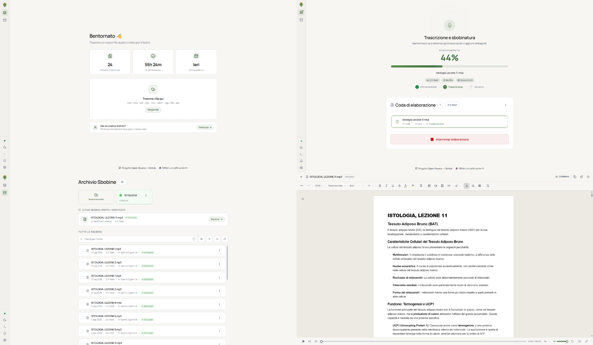

# El Sbobinator

Applicazione desktop open source per trasformare lezioni audio e video in dispense di studio strutturate tramite modelli Google Gemini.

<p align="center">
  <a href="https://github.com/vimuw/El-Sbobinator/releases/latest"></a>
  <a href="https://github.com/vimuw/El-Sbobinator/releases"></a>
  <a href="LICENSE"></a>
</p>

<p align="center">
  
</p>

---

## Funzioni Principali

- **Trascrizione e Sintesi**: Converte registrazioni audio e video in dispense di studio strutturate, ripulendo il parlato da intercalari e ripetizioni e organizzando i contenuti in capitoli, paragrafi ed elenchi puntati.
- **Obiettivo**: Abbattere i tempi di sbobinatura manuale delle lezioni universitarie, fornendo una prima bozza ordinata e pronta per la revisione anziché dover trascrivere da zero ore di registrazione.
- **Modello BYOK (Bring Your Own Key)**: L'applicazione è gratuita e non richiede abbonamenti. Ciascun studente utilizza la propria chiave API personale e gratuita di Google Gemini: la comunicazione avviene in forma diretta tra il computer locale e Google, senza server intermediari.
- **Editor Integrato**: Permette di riascoltare la lezione con il player audio sincronizzato (velocità da 1.0x a 3.0x) mentre si corregge la bozza, con supporto per formule scientifiche (LaTeX) e copia rapida per Google Docs e Word.
- **Archivio Locale**: Conserva lo storico delle lezioni elaborate direttamente sul computer, consentendo di riaprirle in qualsiasi momento e di cercare istantaneamente termini o concetti tra tutte le sbobine salvate.

---

## Download e Installazione

Scarica la versione per il tuo sistema operativo:

| Sistema Operativo | Pacchetto | Installazione rapida |
| :--- | :--- | :--- |
| **Windows** | [**Scarica per Windows (.exe)**](https://github.com/vimuw/El-Sbobinator/releases/latest) | Avvia il file `.exe` e segui la procedura guidata. |
| **macOS** | [**Scarica per macOS (.dmg)**](https://github.com/vimuw/El-Sbobinator/releases/latest) | Apri il file `.dmg` e trascina *El Sbobinator* in **Applicazioni**. |

> [!NOTE]
> L'applicazione verifica automaticamente la presenza di aggiornamenti all'avvio e notifica la disponibilità di nuove versioni.

---

## Guida Rapida

Inizia a sbobinare in 4 passaggi:

### 1. Ottieni la chiave Google Gemini gratuita
L'applicazione non prevede costi né richiede carte di credito. Ogni studente utilizza la propria chiave API personale gratuita di Google:
1. Accedi a [**aistudio.google.com/apikey**](https://aistudio.google.com/apikey) con il tuo account Google.
2. Clicca su **"Create API key"** (oppure *"Get API key"*), seleziona o crea un progetto e conferma.
3. Copia il codice generato (`AIzaSy...`).

### 2. Inserisci la chiave nell'applicazione
All'avvio di **El Sbobinator**, incolla la chiave nel campo iniziale e clicca su **Salva e inizia**. La chiave viene memorizzata in modo protetto nel portachiavi del sistema operativo (Windows DPAPI o macOS Keychain).

> [!NOTE]
> **Consumo per lezione e quota del piano gratuito**: Nel piano gratuito di Google AI Studio, ciascun account dispone di una quota giornaliera di richieste. La trascrizione e revisione completa di una lezione tipica impiega mediamente tra le 15 e le 17 richieste: con una singola chiave è quindi possibile elaborare circa 1 lezione al giorno. Al raggiungimento del limite, la quota si ripristina automaticamente alle 9:00 di mattina (oppure è possibile passare a un piano con fatturazione abilitata su Google AI Studio per quote illimitate).
>
> **Chiavi di riserva**: Nella sezione **Impostazioni** dell'applicazione è possibile configurare chiavi API secondarie di backup.

### 3. Trascina la registrazione e avvia
Trascina il file audio o video direttamente nella finestra dell'applicazione (è possibile inserire più registrazioni in coda) e clicca su **Avvia Sbobinatura**.
- **Formati audio supportati**: `.m4a`, `.mp3`, `.wav`, `.aac`, `.flac`, `.ogg`, `.opus`.
- **Formati video supportati**: `.mp4`, `.mkv`, `.webm`, `.mov`, `.avi`.

### 4. Rivedi ed esporta
Al termine dell'elaborazione, la lezione viene aperta nell'editor integrato dell'applicazione, dove è possibile riascoltare l'audio e correggere il testo. L'esportazione della sbobina avviene unicamente tramite copia e incolla: clicca su **Copia per Google Docs** per incollare la lezione direttamente su Google Docs o Word, mantenendo intatti titoli, elenchi, grassetti e formule.

---

## Privacy e Architettura dei Dati

- **Elaborazione Locale e Diretta (BYOK)**: L'applicazione viene eseguita interamente sul computer dell'utente. I file audio e i testi vengono elaborati in locale e scambiati direttamente con i server di Google Gemini tramite la chiave API personale dello studente (*Bring Your Own Key*), senza alcun transito su server intermediari.
- **Nessun Server Intermediario**: Lo sviluppatore non possiede né gestisce server o database per raccogliere, visualizzare o conservare registrazioni, trascrizioni o chiavi API. Registrazioni, bozze e trascrizioni rimangono archiviate esclusivamente sul disco locale del proprio computer.
- **Termini del Piano Gratuito Google**: Poiché le richieste transitano direttamente verso Google tramite la chiave API personale dello studente, il trattamento dei dati inviati è regolato dai termini d'uso di Google AI Studio (che per il piano gratuito possono prevedere l'impiego dei dati per il perfezionamento dei modelli). Per i dettagli completi, consultare [**DISCLAIMER.md**](DISCLAIMER.md).

---

## Risoluzione Problemi Comuni

### Avviso SmartScreen su Windows ("PC protetto da Windows")
Nei software open source distribuiti senza certificato commerciale a pagamento, Windows può mostrare questo avviso al primo avvio:
1. Nella schermata blu, cliccare su **Ulteriori informazioni**.
2. Cliccare sul pulsante **Esegui comunque**.

### Schermata bianca o vuota all'avvio su Windows 10
Se la finestra resta vuota all'avvio su Windows 10, è necessario installare il componente ufficiale Microsoft gratuito: [WebView2 Runtime](https://go.microsoft.com/fwlink/p/?LinkId=2124703) *(già incluso di serie in Windows 11).*

### Avviso sviluppatore non verificato su macOS (Gatekeeper)
Poiché l'applicazione è open source e distribuita senza certificato a pagamento Apple Developer, macOS potrebbe bloccarne l'avvio o mostrare l'avviso *"L'applicazione è danneggiata e non può essere aperta"*:

- **Metodo standard (macOS Ventura, Sonoma, Sequoia)**:
  1. Aprire **Impostazioni di Sistema** → **Privacy e Sicurezza**.
  2. Scorrere in basso fino alla sezione **Sicurezza**.
  3. In corrispondenza dell'avviso di blocco per *El Sbobinator*, cliccare su **Apri comunque** e confermare con la propria password o Touch ID.
- **Se macOS mostra "App danneggiata" (rimozione quarantena)**:
  Se il file scaricato dal browser viene contrassegnato con questo messaggio, aprire il **Terminale** ed eseguire il seguente comando:
  ```bash
  xattr -cr "/Applications/El Sbobinator.app"
  ```
- **Metodo rapido alternativo (versioni precedenti)**:
  Nella cartella **Applicazioni**, fare clic destro (o `Control` + clic) su *El Sbobinator* e selezionare **Apri**, quindi confermare nella finestra di dialogo.

### Quota giornaliera API esaurita (Errore 429)
Se durante l'elaborazione viene raggiunto il limite giornaliero del piano gratuito (20 richieste), l'elaborazione si arresta temporaneamente. È possibile attendere il ripristino della quota (alle 9:00 di mattina) oppure configurare chiavi API di riserva nella sezione **Impostazioni**.

---

## Note Legali e Responsabilità d'Uso

L'uso del software è riservato a scopi di studio personale ed è vincolato al rispetto del diritto d'autore (L. 633/1941), dei regolamenti accademici sul consenso alle registrazioni, della normativa sulla tutela dei dati personali e sanitari (GDPR) e dei termini d'uso delle API di Google.

Per i termini completi, le condizioni d'uso vincolanti e l'esclusione di responsabilità, consultare il documento [**DISCLAIMER.md**](DISCLAIMER.md).

---

## Supporta il Progetto

Se l'applicazione ti è stata utile per lo studio e desideri supportarne lo sviluppo, puoi offrire un caffè su Ko-fi:

<p align="center">
  <a href="https://ko-fi.com/vimuw"></a>
</p>

---

## Per Sviluppatori

Per eseguire il progetto in locale, eseguire i test o contribuire:
- [CONTRIBUTING.md](CONTRIBUTING.md) — Setup ambiente locale, linter (`ruff`, `eslint`) e suite di test (`pytest`, `vitest`).
- [docs/architecture.md](docs/architecture.md) — Architettura interna moduli Python e interfaccia React.
- [docs/pipeline.md](docs/pipeline.md) — Pipeline di chunking audio, interazione con Gemini e rate limiting.

---

## Licenza

Distribuito con licenza **MIT**. Per i dettagli completi, consultare il file [`LICENSE`](LICENSE).
