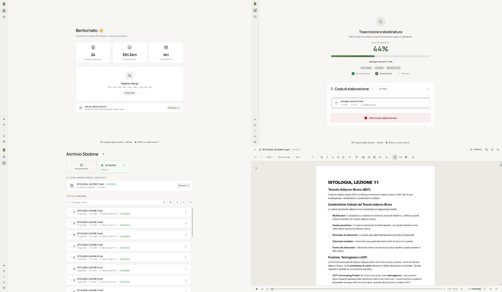

# El Sbobinator

Applicazione desktop per trasformare lezioni audio e video in dispense di studio tramite Google Gemini.

<p align="center">
  <a href="https://github.com/vimuw/El-Sbobinator/releases/latest"></a>
  <a href="https://github.com/vimuw/El-Sbobinator/actions/workflows/build.yml"></a>
  <a href="https://codecov.io/gh/vimuw/El-Sbobinator"></a>
  <a href="https://github.com/vimuw/El-Sbobinator/releases"></a>
  <a href="LICENSE"></a>
</p>

<p align="center">
  
</p>

---

## Funzioni Principali

- **Trascrizione e Sintesi**: Converte registrazioni audio e video in dispense di studio strutturate, ripulendo il parlato da intercalari e ripetizioni e organizzando i contenuti in capitoli, paragrafi ed elenchi puntati.
- **Modello BYOK (Bring Your Own Key)**: L'applicazione è un client desktop autonomo e gratuito, senza abbonamenti né server intermediari gestiti dallo sviluppatore. La comunicazione avviene in forma diretta e cifrata tra il computer locale e le API ufficiali di Google Gemini.
- **Editor Sincronizzato**: Permette di riascoltare la lezione con il player audio sincronizzato (velocità da 1.0x a 3.0x) mentre si corregge la bozza, con supporto per formule scientifiche (LaTeX) e copia rapida formattata per Google Docs e Microsoft Word.
- **Collaborazione P2P in Tempo Reale**: Supporta sessioni di studio condivise con compagni di corso tramite stanze collaborative peer-to-peer (WebRTC + CRDT Yjs), senza memorizzare testi su server esterni.
- **Archivio Locale & Ricerca Istantanea**: Conserva lo storico delle lezioni elaborate sul computer in cartelle organizzabili, con ricerca testuale full-text ad alta velocità tra tutte le sbobine salvate.

---

## Download e Installazione

Scarica la versione per il tuo sistema operativo:

| Sistema Operativo | Pacchetto | Installazione rapida |
| :--- | :--- | :--- |
| **Windows** | [**Scarica per Windows (.exe)**](https://github.com/vimuw/El-Sbobinator/releases/latest) | Avvia l'installer `.exe` e segui la procedura guidata. |
| **macOS** | [**Scarica per macOS (.dmg)**](https://github.com/vimuw/El-Sbobinator/releases/latest) | Apri il file `.dmg` e trascina *El Sbobinator* in **Applicazioni**. |

> [!NOTE]
> L'applicazione verifica automaticamente la presenza di aggiornamenti all'avvio e notifica la disponibilità di nuove versioni.

---

## Guida Rapida

Inizia a sbobinare in 4 passaggi:

### 1. Ottieni la tua chiave Google Gemini
L'applicazione opera in modalità BYOK (*Bring Your Own Key*) e non include chiavi incorporate né server proxy:
1. Accedi a [**aistudio.google.com/apikey**](https://aistudio.google.com/apikey) con il tuo account Google.
2. Clicca su **"Create API key"** (oppure *"Get API key"*), seleziona o crea un progetto Google Cloud e conferma.
3. Copia la chiave generata (`AIzaSy...`).

### 2. Inserisci la chiave nell'applicazione
All'avvio di **El Sbobinator**, incolla la chiave nel campo iniziale e clicca su **Salva e inizia**. La chiave viene memorizzata in modo protetto nel portachiavi sicuro del sistema operativo (Windows DPAPI o macOS Keychain).

> [!NOTE]
> **Costi, quote e termini Google**: El Sbobinator non include un accesso Gemini centralizzato: ogni utente configura e utilizza la propria API key e il proprio progetto Google. Quote, limiti di traffico, disponibilità dei modelli, condizioni contrattuali ed eventuali costi dipendono dal piano e dal progetto Google dell'utente ([Termini Gemini API](https://ai.google.dev/gemini-api/terms)). I tetti di richieste giornaliere (RPD) e al minuto (RPM) sono associati al **Progetto Google Cloud**. Al raggiungimento del limite di quota del piano attivo, l'elaborazione si arresta fino al ripristino della quota (ore 09:00 ora italiana / 00:00 PT).


### 3. Trascina la registrazione e avvia
Trascina il file audio o video direttamente nella finestra dell'applicazione (è possibile inserire più registrazioni in coda) e clicca su **Avvia Sbobinatura**.
- **Formati audio supportati**: `.m4a`, `.mp3`, `.wav`, `.aac`, `.flac`, `.ogg`, `.opus`.
- **Formati video supportati**: `.mp4`, `.mkv`, `.webm`, `.mov`, `.3gp`.

### 4. Rivedi ed esporta
Al termine dell'elaborazione, la lezione viene aperta nell'editor integrato dell'applicazione, dove è possibile riascoltare l'audio e correggere il testo. L'esportazione della sbobina avviene tramite copia e incolla: clicca su **Copia per Google Docs** per copiare la sbobina con la formattazione preservata e incollarla in Google Docs o Microsoft Word.

---

## Privacy e Architettura dei Dati

- **Client Desktop Locale**: L'applicazione viene eseguita sul computer dell'utente e non utilizza un backend gestito dallo sviluppatore. I file e le bozze vengono conservati localmente; i contenuti necessari all'elaborazione AI vengono trasmessi direttamente agli endpoint ufficiali di Google Gemini (`generativelanguage.googleapis.com`) tramite la credenziale dell'utente.
- **Nessun Backend Proprietario**: L'applicazione non dispone di un backend proprietario e non invia file audio, trascrizioni o API key a infrastrutture gestite dallo sviluppatore.
- **Condizioni e Policy Esterne**: Il trattamento dei contenuti trasmessi a Gemini dipende dal servizio, dal piano e dalle condizioni applicabili al progetto dell'utente. Per le condizioni sul trattamento dei dati da parte di Google, consultare i [Termini Aggiuntivi Gemini API](https://ai.google.dev/gemini-api/terms) e il documento [**DISCLAIMER.md**](DISCLAIMER.md).

---

## Risoluzione Problemi Comuni

### Avviso SmartScreen su Windows ("PC protetto da Windows")
Nei software open source distribuiti senza certificato commerciale a pagamento, Windows può mostrare questo avviso al primo avvio:
1. Nella schermata blu, cliccare su **Ulteriori informazioni**.
2. Cliccare sul pulsante **Esegui comunque**.

### Schermata bianca o vuota all'avvio su Windows 10
Se la finestra resta vuota all'avvio su Windows 10, è necessario installare il componente ufficiale Microsoft gratuito: [WebView2 Runtime](https://go.microsoft.com/fwlink/p/?LinkId=2124703) *(già incluso di serie in Windows 11).*

### Avviso sviluppatore non verificato su macOS (Gatekeeper)
Poiché l'applicazione è open source e distribuita senza certificato a pagamento Apple Developer, macOS potrebbe bloccarne l'avvio o mostrare l'avviso *"L'applicazione è danneggiata e non può essere aperta"*:

- **Metodo standard (macOS Ventura, Sonoma, Sequoia)**:
  1. Aprire **Impostazioni di Sistema** → **Privacy e Sicurezza**.
  2. Scorrere in basso fino alla sezione **Sicurezza**.
  3. In corrispondenza dell'avviso di blocco per *El Sbobinator*, cliccare su **Apri comunque** e confermare con la propria password o Touch ID.
- **Se macOS mostra "App danneggiata" (rimozione quarantena)**:
  Se il file scaricato dal browser viene contrassegnato con questo messaggio, aprire il **Terminale** ed eseguire il seguente comando:
  ```bash
  xattr -cr "/Applications/El Sbobinator.app"
  ```
- **Metodo rapido alternativo (versioni precedenti)**:
  Nella cartella **Applicazioni**, fare clic destro (o `Control` + clic) su *El Sbobinator* e selezionare **Apri**, quindi confermare nella finestra di dialogo.

### Quota giornaliera API esaurita (Errore 429)
Se durante l'elaborazione viene raggiunto il limite di quota del piano attivo, l'elaborazione si arresta. È possibile attendere il ripristino della quota (ore 09:00 ora italiana / 00:00 PT) per riprendere la trascrizione.

---

## Note Legali e Responsabilità d'Uso

El Sbobinator è pensato per l'utilizzo personale a fini di studio. L'utente è responsabile del rispetto della normativa applicabile, dei regolamenti del proprio ateneo, della tutela dei dati personali e dei termini d'uso delle API di Google.

Per i termini completi, le condizioni vincolanti e l'esclusione di responsabilità, consultare il documento [**DISCLAIMER.md**](DISCLAIMER.md).

---

## Per Sviluppatori

Per eseguire il progetto in locale, eseguire i test o contribuire:
- [CONTRIBUTING.md](CONTRIBUTING.md) — Setup ambiente locale, linter (`ruff`, `eslint`) e suite di test (`pytest`, `vitest`).
- [docs/architecture.md](docs/architecture.md) — Architettura interna moduli Python e interfaccia React.
- [docs/pipeline.md](docs/pipeline.md) — Pipeline di chunking audio, interazione con Gemini e rate limiting.

---

## Licenza

Distribuito con licenza **MIT**. Per i dettagli completi, consultare il file [`LICENSE`](LICENSE).
